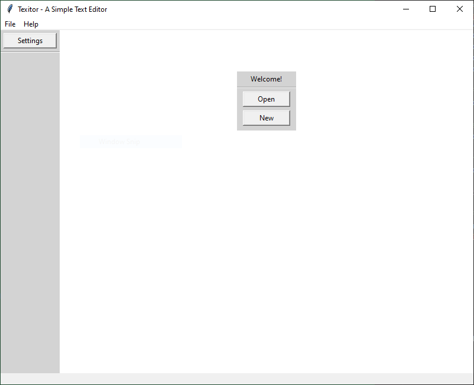
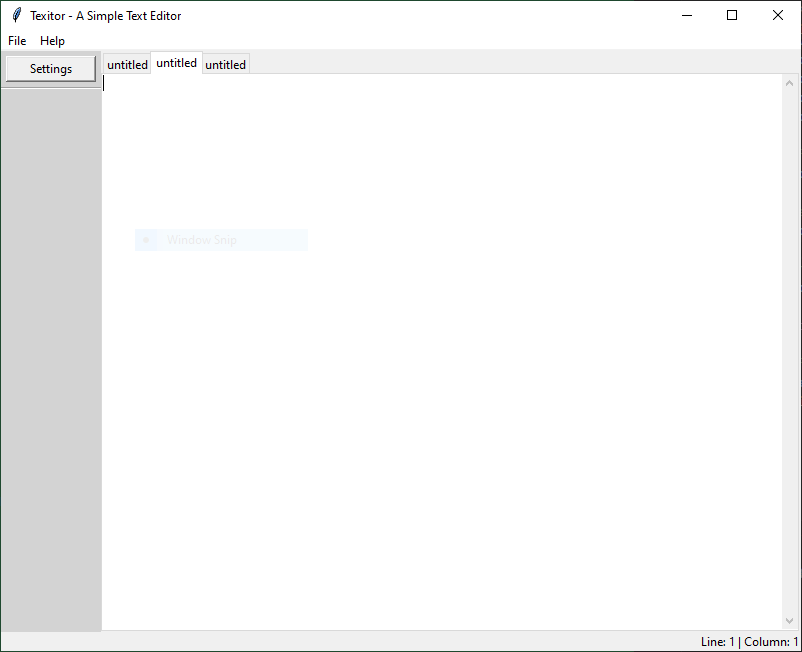

# Texitor ~ A Simple Text Editor

## Overview

This project is a simple text editor built with Tkinter, a python library. The program's name is Texitor, and it provides many of the basic controls and key bindings you'd expect from a lightweight editor. I've made this program just to gain hands-on experience with GUI design, event handling, and state management in the Tkinter Python library. 

## Features

- Create, open, and save files
- Multi-tab editing support
- Cut, copy, and paste functionality
- Undo and redo support
- Extensive keyboard shortcut support

## Key Bindings

- **Ctrl + n** --> New File
- **Ctrl + o** --> Open File
- **Ctrl + s** --> Save File
- **Ctrl + Shift + S** --> Save As
- **Ctrl + x** --> Cut
- **Ctrl + c** --> Copy
- **Ctrl + v** --> Paste
- **Ctrl + z** --> Undo
- **Ctrl + Shift + Z** --> Redo
- **Ctrl + tab** --> Switch Tab
- **Ctrl + Shift + tab** --> Reverse Switch Tab

## Requirements

- **Python 3.x**
- **Tkinter** (typically comes with most Python installations)

## Running the Program

```bash
python textEditor.py
```

## Screenshots

When opening the app, you'll see this screen:



While editing a file:



## Unfinished Features / Known Limitations:

- Settings page isn't implemented yet.
- Integrated terminal is not functional yet.
- Help menu tab is empty and not functional yet.
- The editor does not yet detect unsaved changes before exiting.

## Questions

If you have any questions related to the code, feel free to ask but there's a good chance I might never answer it since I'm barely ever on this site.

This program has been tested on Windows 10. Compatibility with other operating systems has not been verified.

## License

This project is licensed under the **Apache 2.0 license.**

## Author

Created by **Artem** as a learning project for exploring Python GUI development with Tkinter. 
